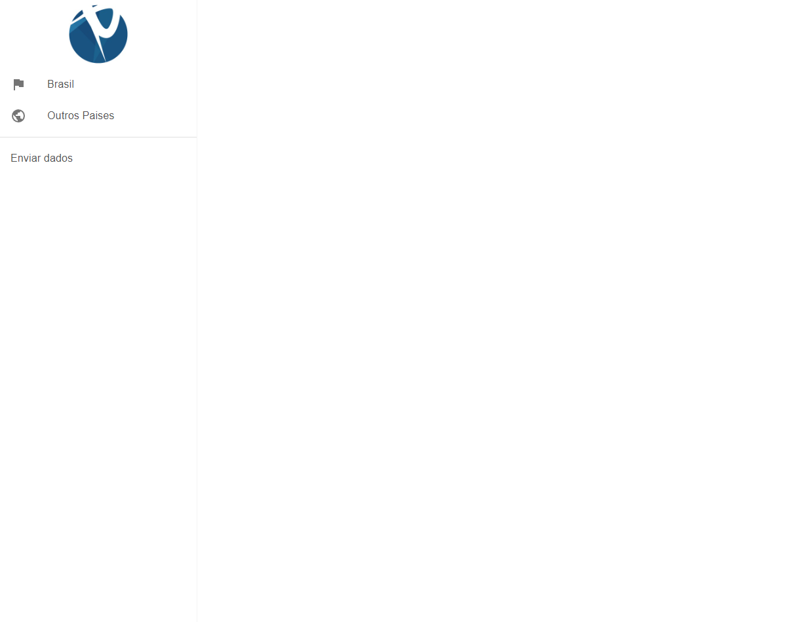
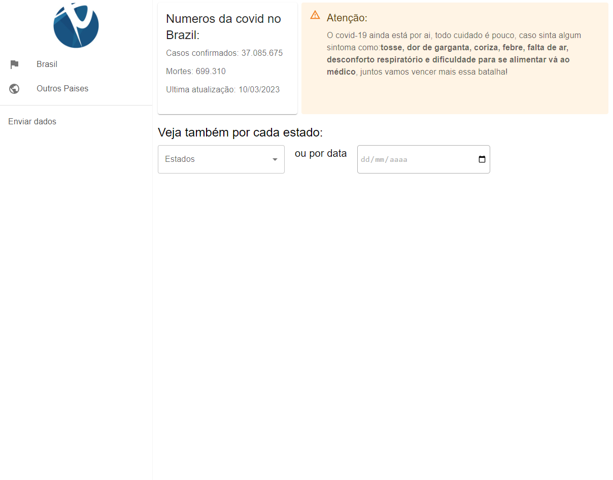
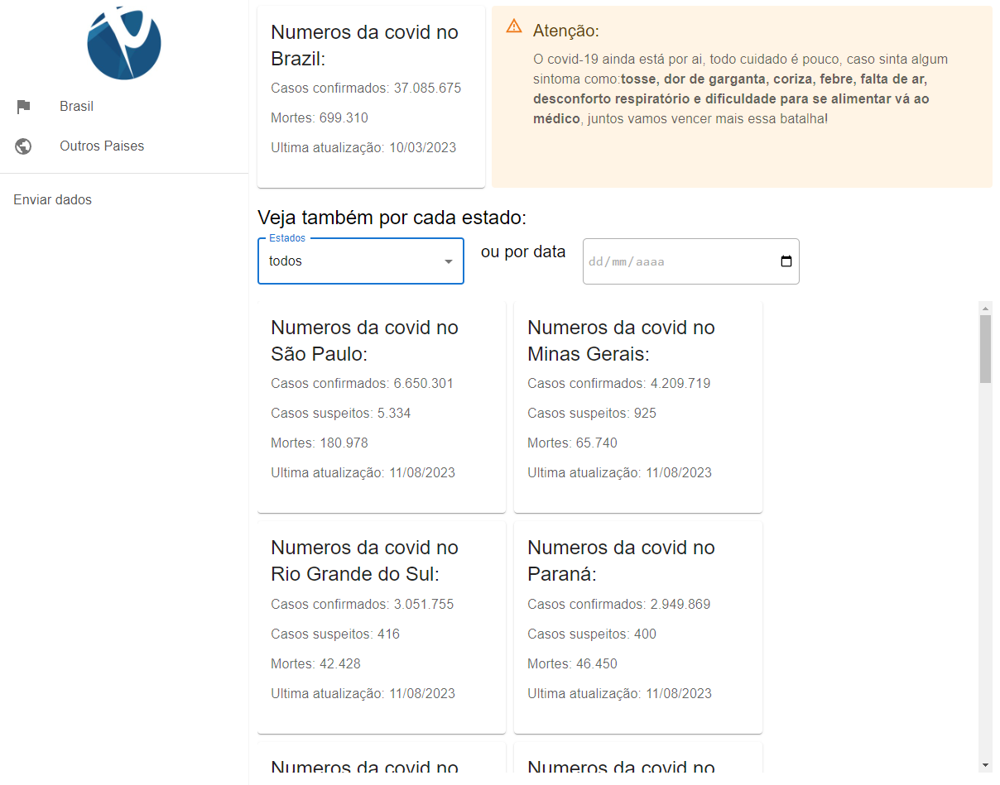
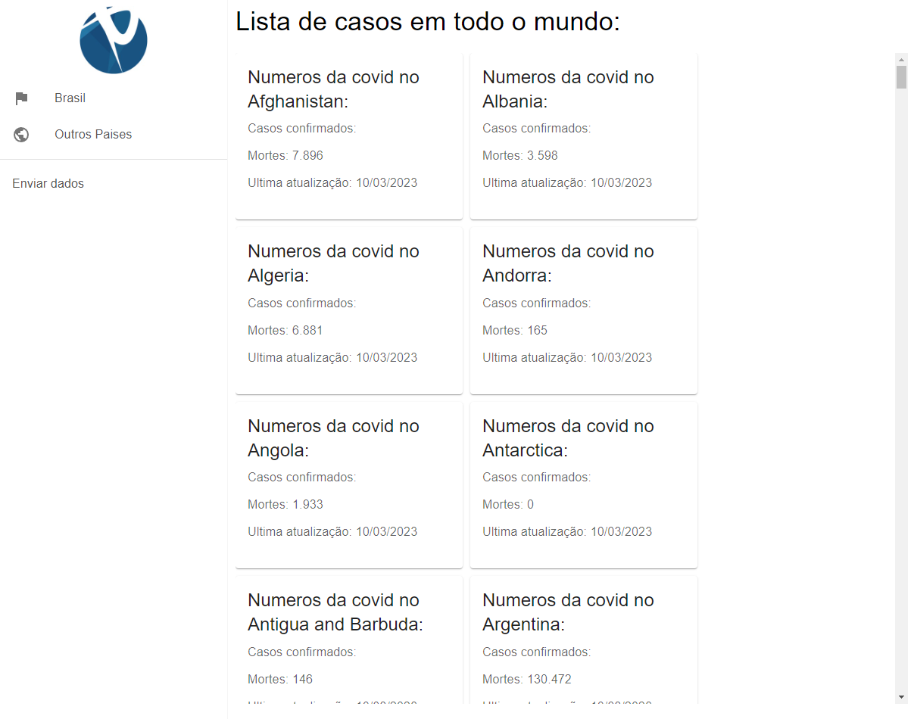
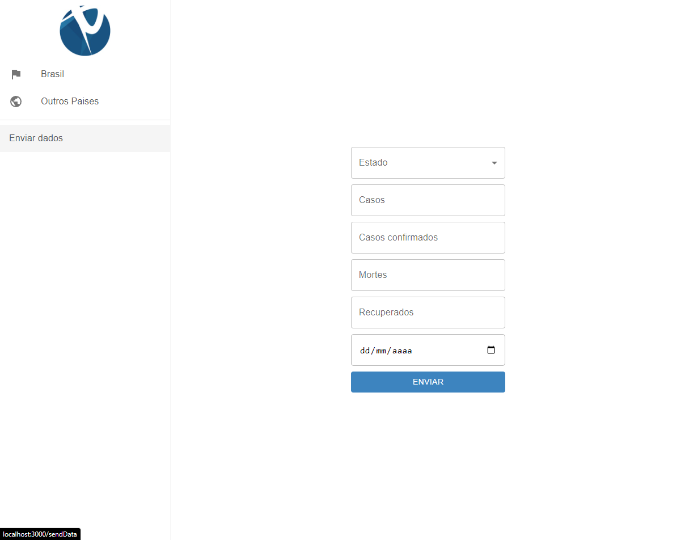
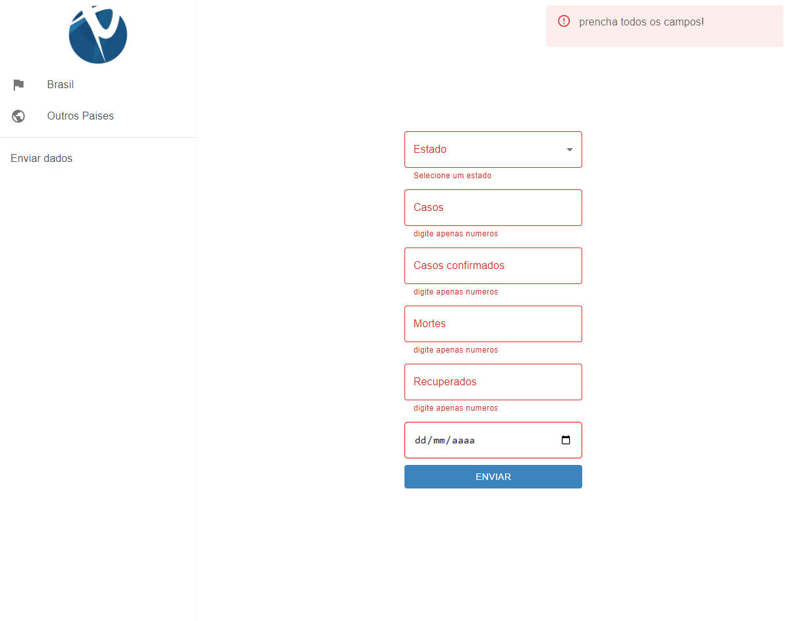

# Inicio

Esse projeto foi criado com: [Create React App](https://github.com/facebook/create-react-app).

## Iniciando o sistema

### Para rodar o sistema após baixar o repositório, rode os comandos no terminal:

 `npm install`

### depois de toda instalação dos pacotes node, rode:

 `npm start`
    O sistema devera iniciar na porta: localhost:3000 
    pode usar o atalho (ctrl + click) na url para abrir o navegador na aba do sistema: [http://localhost:3000]

## Demo
<a href="https://consulta-covid.vercel.app/">Demo - vercel</a>

## Tecnologias utilizadas
<a href="https://axios-http.com/ptbr/docs/intro">Axios</a>: utilizado para criar as chamadas HTTP para api do covid-19. 
<a href="https://react.dev/">React</a> Bibliotéca utilizada para criar o sistema. 
<a href="https://momentjs.com/">Moment</a> Utilizado para manipulação de datas. 
<a href="https://mui.com/">Material-UI</a> Biblioteca utilizada para estilazação do sistema. 
<a href="https://www.npmjs.com/package/react-router-dom">React-Router-Dom</a>Utilizado para criar as rotas do sistema.

## Funcionalidades do sistema

- [x]Consultar os casos de covid no Brasil
- [x]Consultar os casos de covid por estado do Brasil
- [x]Consultar os casos de covid de todos os estados por data 
- [x]Consultar os casos de covid em outros paises
- [x]Formulario para envio de dados do covid em um estado do Brasil

## Layout

## Desafio

Esse sistema foi criado para corresponder aos seguintes requisistos:  
  

 Criar uma consulta que seja possível visualizar o status atual de todos os estados da
 federação ou de apenas um estado, onde seja possível selecionar o estado em um select ou algum
 componente similar. O status é a quantidade de casos, mortos, suspeitos.
 Criar uma consulta onde seja possível visualizar o status do COVID 19 no Brasil em uma data
 específica.
 Criar uma consulta que permite consultar o status da COVID 19 em outros países.
 Criar um formulário onde seja possível preencher o campo de estado, casos, confirmados,
 mortos, recuperados e data, onde todos os campos devem ser de preenchimento obrigatório. 
 Apesar de não ter API para enviar os dados do formulário, logo após as validações acima, exibir uma
 mensagem natela ou no console com o JSON gerado dos dados do formulário que seria enviado para
 umaeventual API

